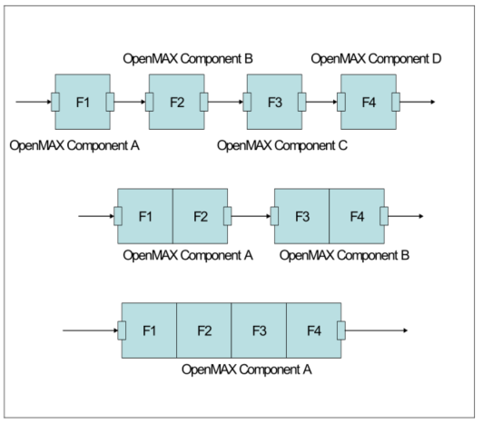
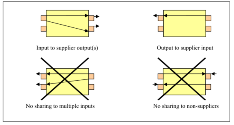
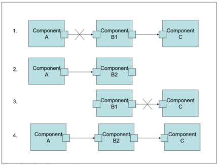
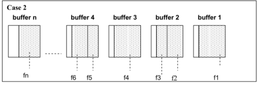

#OpenMAX IL 介绍和框架
本章介绍了OpenMAX的特点和框架

##2.1  OpenMAX IL 简介
OpenMAX IL层API定义了一个用于在系统提供的软件组件的接入层软件接口。目的是让拥有不同方法的组件提供一个标准化的接口和命令集， 来构建和销毁组件。

###2.1.1 架构概述
如果一个系统，需要四种多媒体处理模块，记为F1，F2，F3和F4。这些模块可能来自不同的公司或部门。每一个处理模块可能都有不同的初始化/销毁，配置和数据传输接口。OpenMAX IL的API可以将这些不同的接口或模块封装为标准的组件。

该API包括一个可以让来自不同的供应商/组织之间可以彼此交换数据的相互兼容组件的标准协议。

OpenMAX IL API的上层软件为IL客户端实例，可以是一个多媒体框架或是一个应用程序。IL客户端与一个称之为核心（Core）的集中式IL实例交互。 IL客户端使用OpenMAX Core进行加载和卸载组件，建立两个OpenMAX组件之间的直接通信，并且访问组件的功能方法。 

IL客户端总是通过IL Core与组件进行通信。在大多数情况下，这种通信是通过调用IL Core的一些宏方法，这些宏可以被直接翻译为一些组件的方法。特殊情况（当IL客户端调用一个实际的核心功能）包括组件的创建，销毁以及两个组件管道的连接。

组件内嵌了多媒体处理功能。虽然本规范明确规定了OpenMAX Core的功能，组件供应商定义了组件的功能。组件可以操作四种类型的数据：音频，视频，图像，和其他（例如，用于同步的时间数据）。

一个OpenMAX组件提供了通过其组件句柄的一系列标准组件函数接口。这些函数允许客户端获取和设置组件和端口的配置参数，获取和设置组件的状态，发送命令给组件，接受事件通知，分配buffer，与单一组件端口建立通信，并连接两个组件端口之间的通信。

每一个OpenMAX组件应该至少有一个端口保证OpenMAX一致性。虽然供应商可能会提供一个兼容OpenMAX的组件，它没有端口。 大多数一致性测试依赖至少一个端口。OpenMAX所定义端口类型可以根据所传输的数据类型分为四类：音频、视频、图像和其他。每一个端口可以定义为为输入或者输出端口，这取决于它是否消耗或生产buffer。在一个含有四个多媒体处理功能的模块F1，F2，F3，F4的系统中，系统需要为每一个功能提供OpenMAX标准接口。开发人员可以轻易的任意组合这些功能。功能的分离是基于端口的划分。图2-1显示了这些功能的可能组合。

**表 2-1. OpenMAX实现的几种形式**

###2.1.2 名词解释
本小节介绍了OpenMax IL 中所用的字母缩写和关键词定义

####2.1.2.1  字母缩写
表2-1 列举了OpenMAX IL中首字母缩写的含义.

| 首字母缩写 | 含义 |
| ------------- | ------------- |
| IPC | 进程间通信 |
| OMX | OpenMAX功能和结构的名称前缀。例如，一个组件可以处于OMX_StateExecuting状态。|

**表 2-1. 首字母缩写**

####2.1.2.2  关键词定义
表 2-2 列举了OpenMAX IL中关键词的定义.

| 关键词 | 含义 |
| ------------- | ------------- |
| Accelerated component | OpenMAX组件封装了一部分在加速器中运行的功能。加速组件具有某些特殊的特性，如能够支持某些类型的管道(tunnel)。|
| Accelerator | 硬件加速功能处理器。这种硬件模块也可称为硬件加速器。注意，加速器也可以不是硬件而是运行在另一个处理器上的软件模块。|
| AMR | 自适应多媒体检索的缩写，是一种从3GGP组织提出的自适应码率编解码算法。|
| Host processor | 多核系统中控制多媒体加速的处理器，通常运行高级操作系统。|
| IL client |  调用OpenMAX核心（Core）或组件(component)方法的软件层。IL客户端可能是低于GUI的软件层，如Gstreamer，也可能在GUI下面几层。在此文档中，应用是指任何调用OpenMAX方法的软件模块。|
| Main memory | CPU和加速器共享的外部存储器。|
| OpenMAX component | 封装目标系统所需功能的组件。OpenMAX封装了提供功能的标准接口。 |
| OpenMAX core | 与系统平台相关的代码，提供了找到并加载OpenMAX组件到内存的必要功能。当应用不再需要此OpenMAX组件时，Core也负责销毁内存中的组件。总的来说，加载OpenMAX组件到内存后，Core将不参与组件和应用程序之间的通信|
| Resource manager | 管理系统中硬件资源的软件模块。 |
| RTP |  实时协议的缩写，它是用于传输实时数据的因特网标准协议，包括音频和视频。|
| Synchronization | 组件之间相互控制的机制。|
| Tunnels/Tunneling | 两个OpenMAX组件之间标准数据通路。|

**表 2-2. 关键词定义**

###2.1.3 系统组件
图2-2显示了使用OpenMAX进行通信的各种类型。每个组件可以有任意数量的端口用于数据通信。具有单个输出端口的组件称为源组件(Source component)。具有单个输入端口的组件称为接收器组件(sink component)。完全运行在主处理器上的组件称为主组件。在松耦合的加速器上运行的组件称为加速器组件。OpenMAX可能直接与应用程序或异构的多媒体框架集成。

下面描述了三种类型的通信。非通道通信(Non-tunneled)指的是IL客户端和组件之间的数据Buffer交换机制。通道(Tunneling)指的是组件之间直接交换数据Buffer的标准机制。专有通信(Proprietary）指的是两个组件之间直接信息数据通信，也可以当通道请求（tunneling request）时，作为一个两个组件通道的替代方案。

**表 2-2. OpenMAX IL 系统组件**

####2.1.3.1  组件Profiles
OpenMAX组件功能分为两个profile：base profile和interop profile。

Base profile 应该支持非管道（non-tunneled）通信， 可能支持专有通信（proprietary），不支持管道（tunneled）通信。

Interop profile是base profile的一个超集，它应该支持管道（tunneled）和非管道（non-tunneled）通信，可能支持专有通信。

Interop profile和base profile的主要区别是是否支持管道（tunneled）通信。定义base profile的意义在于简化OpenMAX的实现难度，因为并不需要实现tunneled 通信

###2.1.4 组件状态
每一个OpenMAX组件的运行可以视为一系列状态的转移，如图2-3。每一个组件的初始状态为unloaded。组件可以通过调用OpenMAX Core的接口进行装载。其他的状态转移可以通过直接和组件进行通信来完成。

当使用不正确的数据进行状态转移的时候，组件可以进入非法（invalide）状态。例如，如果回调函数的指针指向非法地址的时候，组件可能会超时并且向IL客户端发出错误警告。IL客户端检测到非法状态时， 应该停止运行，释放，卸载并且重新加载这个组件。图2-3描绘了所有的状态均可以跳转到非法状态，但非法状态只能跳转到unload状态，并且重新加载组件。

**表 2-3. 组件状态**

由于需要获得所需要的资源， 进入IDLE状态可能会失败。当从LOADED向IDLE转移失败时， IL客户端可以重试或者转入等待资源（Wait for resource）状态。当进入等待资源（wait for resource）状态是， 组件会向资源管理器注册，当资源可以可以获得时得到提醒。资源管理器随后将组件转至IDLE状态。IL客户端发送控制命令进行除了非法（invalide）状态以外的所以其他状态转移。

IDLE状态表明组件已经获得所有所需资源，但此时并没有处理数据。EXECUTING状态表明组件正在接受数据Buffer，进行处理，并且会发出响应的回调（见第3节）。PAUSE状态保持了数据buffer执行的上下文，但并不处理或交换数据或。从PAUSED到EXECUTING的状态转移可以当组件由挂起到继续时能够处理buffer。

从EXECLUTING到PAUSED或者IDLE的转移可能会导致处理过的buffer上下文丢失，这时候需要重新开始一个新的流。IDLE到LOADED的转可能会导致运行的资源例如通信Buffer的丢失。

###2.1.5 组件架构
表2-4描述了组件的架构。注意，该组件只有一个入口（通过一个拥有一系列标准方法接口的句柄），但可能会有多个回调，取决于组件有多少个端口（port）。每个组件会调用指定的IL客户端的事件处理程序（event handler）。每个端口（port）会调用（或回调）制定的外部方法。每个端口（port）会和一个指向buffer头的队列关联。这些buffer头指向真正的buffer。命令函数（command functions）也有一个命令队列。所有的参数或者配置函数需要提供一个指定的索引并包括一个参数或配置的结构，如图2-4。

**图 2-4. OpenMAX IL API 组件架构**

端口必须支持向IL客户端的回调。当组件是interop profile的时候，必须支持和其他组件之间的通信。

###2.1.6 通信行为
一旦OpenMAX core获得了组件的句柄，便可以开始对组件进行配置工作。当端口的数量被确定后，组件数据通信的方法便可以调用，并且是不可以阻塞的。
每一个端口会指定一个特定的数据格式，并且组件会进入合适的状态。数据通信是和组件的端口（port）绑定的。IL客户端总是会调用输入端口`OMX_EmptyThisBuffer`接口（具体信息可以看3.2.2.17小节），调用输出端口（port）的`OMX_FillThisBuffer`（具体信息可以看3.2.2.18小节）。如果是同步执行，在返回之前，回调用回调函数`OMX_EmptyBufferDone` 或 `OMX_FillBufferDone`。 图2-5表述了同步执行和异步执行的对比行为。注意， IL客户端不应该假设返回和回调的先后顺序， 必须对同步和异步的OpenMAX组件都进行异构集成。

**图 2-5. 异步对比同步操作**

与组件的数据通信总是指向特定的组件端口。每一个端口（port）有一个分配供使用的buffer，最小数量由组件制定。端口将buffer头与每一块buffer相关联。buffer头拥有buffer数据的引用，并且提供响应的元数据（metadata）。每个组件端口应该既可以分配自己的buffer也可以使用分配好的buffer，往往某一种方案会比其他的效率高。 

###2.1.7 管道（tunneled） buffer的分配和共享
本小结描述了管道（tunnel）组件的buffer分配和共享。对于给定的管道，会有一个端口提供buffer并且将buffer转递给接受的端口。最简单的情况，提供者同时会分配这些buffer。然而，在适当的情况下，管道（tunnel）组件会选择复用buffer，以免多次内存拷贝。这种做法被称为buffer共享

两个端口之间的管道表示了两个端口之间的依赖关系。buffer共享扩展了这个依赖关系，使得共享同一组buffer的所有端口形成隐式依赖链。该依赖链中的一个端口分配所有的共享buffer。

共享buffer是在组件内部实现的，并且对其他组件透明。接受端口并不知道提供者是分配还是复用了这些buffer。此外，输出也不知道输入是否复用了这些buffer。

严格的说，一个组件只需要遵守他所需要的外部语义，并且实现buffer共享。更具体的说，外部语义要求一个组件能够做到如下：

-  在所有输出端口（Provide buffer）上提供buffer。
-  精确地在其端口上传递buffer要求。
-  从一个输出端口向一个输入端口通过调用`OMX_EmptyThisBuffer`转递数据
-  从一个输入端口向一个输出端口通过调用`OMX_FillThisBuffer`返回一个buffer

如果一个组件使用共享buffer, 它需要实现如下功能：

-  在某些输出端口上提供可复用的buffer
-  当端口上有buffer通信的需求时可以共享端口。
-  调用`OMX_EmptyThisBuffer`和其对应的回调函数`OMX_EmptyBufferDone`之间， 内部会从输出端口到另一个输出端口传递一个buffer
  

OpenMAX虽然没有明确要求组件支持共享, 但定义了外部构件语义需要兼容共享方式。本节讨论在共享buffer的上下文中实现这些语义。如果没有组件共享buffer，则实现简化为一组简单的步骤和过称。

####2.1.7.1  相关术语
本节描述了tunneled buffer的分配和共享。图2-6描绘了概念。

**图 2-6. Buffer分配和共享关系的例子**

在一对管道连接的端口中，端口会调用他的邻居端口`UseBuffer`接口告知自己为输出端口。输出端口并不一定需要分配内存，它可以复用同组件下另一端口的buffer。在图2-6中，端口a和c描绘了输出端口。

从邻居端口接收到`UseBuffer`调用的端口是一个输出端口。图2-6中的端口b和d描绘了出入端口。

一个端口的管道端口是指其共享管道的邻居端口。例如，在图2-6中端口b是端口a的管道端口。同理，a也是b的管道端口。

一个分配器端口（allocator port）是一个输出端口，而且可有分配自己的buffer。图2-6中的端口a是唯一的分配器端口。

共享端口（sharing port）是可以复用同一组件中其他端口buffer的端口。例如，图2-6中端口c就是共享端口。

一个管道组件指的是至少有一个管道的组件。

端口buffer的需求包括了buffer的数量和每块buffer的大小。buffer所需的最大值是指所需数量的最大值和所需大小的最大值。一个端口通过其管道端口调用`OMX_GetParameter`接口，并传入结构体`OMX_PORTDEFINITIONTYPE`参数来获得buffer的需求。注意，一个端口可能从其共享buffer的端口而不是接受`OMX_GetParameter`接口来确定其buffer的需求，因为他们隶属于同一个组件。

####2.1.7.2  IL客户端组建设置
为了配置管道组件，IL客户端需要按顺序进行下面的操作：

1. 加载所有的管道组件并配置这些组件的管道。
2. 将所有的管道组件的状态由loaded转为idle。

如果IL客户端没有按此进行操作，一个管道组件可能由于组件间的依赖关系而永远无法转移到idle状态。

####2.1.7.3  共享时组件状态由loaded到idle的转移
在`OMX_SetupTunnel`调用时，管道的两个端口会确立哪个端口（输入或输出）是buffer提供者。因此，当一个组件被要求从loaded转移到idle时，它会知道它所有提供者和接受者端口的角色。

当命令组件由loaded转移到idle的时候，它需要按顺序进行下面的操作：

- 1.组件决定那种buffer共享它需要实现。如果有，需要遵循下列规则：

	- a) 它的一个输入端口到一个或多个输出端口、一个输出端口到一个输入端口。
	- b) 只有提供者端口可以复用其他端口的buffer。
	- c) 一个组件在多个输出端口上共享buffer需要输出的端口是只读的，如图2-7所示。

**图 2-7. 可能的共享关系**

- 2.组件确定哪个是其供应端口和分配器端口（如果有有的话）。如果不从同组件的非供应端口复用buffer是，一个供应端口也是一个分配端口（即，不是一个分享端口）。在图2-8中，供应端口是有箭头指向外面的端口，非供应端口是有箭头指向它的端口。端口上的箭头表明了共享关系。端口旁边的正方形（buffer）表明了这是一个分配器端口。
 

**图 2-8. 确定分配器**

- 3.组件在每个分配器端口上分配buffer的策略如下：
	- a) 每个复用分配器端口buffer的端口，分配器端口会确定其共享端口的buffer需求。见下面的条例A。
	- b) 分配器端口通过调用`OMX_GetParameter`决定其管道端口buffer要求。参见条例B。
	- c) 分配器端口根据自己的最大需求，管道端口的要求，和所有的共享端口的要求分配buffer。
	- d) 分配器端口通过调用`OMX_SetParameter`的`OMX_IndexParamPortDefinition`设置合适的`nBufferCountActual`值，来通知非供应端口实际的buffer数量。见下面的条例E。
	- e) 分配器端口和每个复用其buffer的共享端口共享buffer。见条例D。
	- f) 每个分配的buffer，分配器端口调用其管道端口的`OMX_UseBuffer`接口。参见条例C。
	

组件还应遵循下列条例：

- A. 一个共享端口要确定其需求，共享端口应先调用其管道端口的`OMX_GetParameter`来查询需求，然后返回自己和其管道端口的最大要求。
- B. 当一个非供应端口接受到`OMX_GetParameter`调用来查询自己的buffer需求是，它需要首先确定所有复用自己buffer的端口的需求（见条例A），然后返回自己和其他这些端口的最大值。
- C. 当一个非供应端口接受到来自其管道端口的`OMX_GetParameter`调用，它需要把这些buffer和组件内所有和它复用buffer的端口共享。
- D. 当端口A和组件内复用其buffer的端口B共享一个buffer时，端口B需要调用 `OMX_UseBuffer`并且将buffer传递给他的管道端口。
- E. 当非供应端口接受到其管道端口的`OMX_SetParameter` 的`OMX_IndexParamPortDefinition`调用时，供应端口应该将值`nBufferCountActual`传递给所有复用其buffer的端口。同理，每一个通过这种方式收到 `nBufferCountActual`值的供应端口，需要通过调用传递`OMX_SetParameter` 的`OMX_IndexParamPortDefinition`的接口将`nBufferCount` 值给他的管道端口， buffer的实际数量以这种方式在整个依赖链中传播。

当一个组件获得所需的所有buffer，便可以由loaded状态转为idle状态。

在实践中，可以有如下的直接映射：

-  步骤1~3对应loaded向idle状态的转变
-  条例A对应一个共享端口的buffer需求的子函数
-  条例B对应`OMX_GetParameter`的实现
-  条例C对应`OMX_UseBuffer`的实现
-  条例D对应一个端口向另一个端口分享buffer的子函数
  
为了搞清楚合理分配buffer的这些步骤和条例，可以参考图2-9.注意这个例子是用于实践上面步骤和条例的，实际的用例会负责的多。

**图 2-9. Buffer分配的例子**

下面集中讨论组件3如何到idle状态的，其他的组件类似。

当IL客户端命令组件3从loaded向idle转移时，它需要遵循下面的步骤：

1. 组件3注意到它可以重用端口d的buffer，因为端口e是一个供应者端口。组件3建立了端口d到端口e的共享关系。
2. 既然端口d是一个供应者端口并且不复用buffer，那么端口d是一个分配者端口。
3. 端口3分配并部署端口d的buffer:
	- a) 既然端口e复用端口d的buffer，组件3确定端口e的需求。根据条例A， 端口e调用端口f的`OMX_GetParameter`确定f的需求，并将自己的和f的最大值报告出去。
	- b) 端口d调用端口c的`OMX_GetParameter`接口确定他的buffer需求。根据条例B，端口C需要确定端口b的buffer需求。更具提条例A，端口b返回自己和a的最大需求。端口c得到这个需求在和自己的需求比较返回最大值。
	- c) 端口d根据自己的需求和端口c，e返回的最大值分配buffer， 分配的buffer是根据端口a,b,c,d,e,f需求的最大值确定的，所有的端口都复用端口d的buffer。
	- d) 既然端口e复用端口d的buffer，组件3用端口e分享这些buffer。根据条例D，端口e调用端口f的`OMX_UseBuffer`接口以分享这些buffer。 
	- e) 对于每块分配的buffer，端口d调用端口c的 `OMX_UseBuffer`。根据提条例C，端口C和B分享这些buffer。而端口b根据条例D调用端口a`OMX_UseBuffer`

至此，所有组件的所有端口都有自己的buffer，所有的组件都可以转移到idle状态。

####2.1.7.4  使用共享buffer的协议
当一个输入端口收到`OMX_EmptyThisBuffer`调用得到一块共享buffer时，输入端口可以通过遵循下面的准则复用这块buffer到其共享端口：

- 输出端口要在其管道端口的返回相应的回调函数`OMX_EmptyBufferDone`前，调用其管道端口的`OMX_EmptyThisBuffer`方法。 
- 输入端口不能在所有的与其共享buffer的输出端口返回`OMX_EmptyBufferDone`之前返回`OMX_EmptyBufferDone`。 
 
####2.1.7.5  非共享情况下组件状态由loaded到idle的转移
如果一个组件没有共享buffer，和共享buffer的情况相比起来，组件的实现的步骤和准则会简单一些：

一个非共享组件要从loaded转移到idle状态时，它需要按下面的顺序进行操作：

1. 组件确定那些buffer共享需要实现。在这情况下，没有共享需要实现。
2. 组件确定那些是供应端口，如果有，他们都是分配者端口。所有的供应端口都是分配者端口。
3. 组件按照下面准则为所有的分配者端口分配buffer：
	- a. 由于没有buffer共享，组件不需要获取共享端口的需求。
	- b. 分配器通过调用`OMX_GetParameter`来确定其管道端口的buffer需求。
	- c. 分配器端口根据自身和其管道端口对buffer需求的最大值来分配buffer。
	- d. 由于没有共享，没有buffer需要转递到共享端口。
	- e. 对每一块分配出来的buffer， 分配器端口调用其管道端口的`OMX_UseBuffer`
	
所有共享组件的准则不适用与非共享组件。

###2.1.8 端口重连接
端口的重连接可以使一个管道组件被另一个管道组件替换而不需要卸载周围的组件。图2-10，组件B1被组件B2替换。要做到这一点，组件A的输出端口和组件B的输入端口首先应该用disable的命令禁用。一旦所有所有分配的buffer回到他们的拥有者并且释放，组件A的输出端口便可以连接到组件B2.组件B1输出端口和组件C的输入端口应该给予同样的禁用命令。所有分配buffer回到他们的拥有者并被释放后，组件C的输入端口可以重新连接到组件B2的输出端口。然后，可以给所有的端口发启用命令。

**图 2-10. 端口重连接**

在某些情况下，例如音频，将一个组件重新连接到另一个组件，老的组件淡出新的组件淡入也是可以的。图2-11展示了这是如何工作的。步骤1，组件A发送数据给组件B1。步骤2，IL客户端首先建立组件A和B2之间的管道，再建立B2和C之间的管道，然后启用两个管道上的所有端口。组件C可能将B1和B2通过不同的增益进行混音。步骤3，组件B1和组件A，C连接的端口都被禁用，B1的资源也会被释放。

**图 2-11. 组件重连接**

###2.1.9 队列和清空
一个单独的命令队列能够在使用非管道通信时让组件将没有处理的buffer清空并返回给IL客户端，或在使用管道通信是返回给管道端口。图2-12，假设端口有一个输出端口，它使用了IL客户端分配的buffer。在这个例子中，客户端在发送清空命令之前发送了一串共5块buffer给组件。处理清空命令时，组件按照原先的顺序返回每一个未处理的buffer，并触发事件处理程序通知IL客户端。有两块buffer已经在收到清空命令之前被处理了。组件返回剩下的三块buffer并产生一个事件。IL客户端应该等待此时间然后再去尝试释放这个组件。

**图 2-12. 清空队列**

###2.1.10  标记buffer
当遇到标记buffer是，IL客户端还可以触发一个事件。一块buffer可以在其头部被标记。标记在OpenMAX组件的输入端口和输出端口直接内部传递。当遇到这块标记buffer是，组件可以发送一个时间给IL客户端。图2-13显示了这是怎么工作的。

**图 2-13. 标记buffer**
IL客户端发送一个命令来标记buffer。组件的输出端口发送的下一个buffer被标记成B1。组件B处理buffer B1后提供了加入此标记的buffer B2.当组件C从输入端口中收到这个标记过的buffer B2，组件处理这块buffer出发事件处理程序。

###2.1.11  时间和回调
Six kinds of events are sent by a component to the IL client:
组件发送给客户端一共有六种事件：

- 任何时间都可能遇到错误时间
- 命令成功处理后会触发一个命令完成通知时间
- 组件检测到一块标记的buffer时会触发标记buffer事件
- 当组件改变其端口设置时会触发端口设置改变通知事件
- 码流结束时（EOS）会触发buffer标志事件。
- 组件获得正在等待的资源时会触发资源获得事件。

Ports make buffer handling callbacks upon availability of a buffer or to indicate that a buffer is needed.
端口标记buffer的处理回调指示了buffer的可用性或表明buffer是需要的。

###2.1.12  Buffer载荷(Payload)
端口的配置用于确定传输到组件端口上的数据格式，但配置并没有定义数据怎么样存储在buffer中的。

通常有三种情况描述了数据如何填充buffer，每一种都有其优点。

在所有的情况下，buffer中有效的数据范围和位置通过buffer头部中的参数`pBuffer`, `nOffset` 和`nFilledLength`来定义。参数`pBuffer`指向了buffer的起始地址。参数`nOffset`指示了buffer的起始位置和有效数据开始之间的字节数。参数`nFilledLength`指定了buffer中连续有效数据的字节数。因此buffer中的有效数据位于`pBuffer` + `nOffset` 和 `pBuffer` + `nOffset` + `nFilledLength`之间。

下面的案例代表了在编解码时输入或输出到一个组件的压缩过的数据。在所有的情况中，buffer仅为数据提供传输机制，而对内容没有特别的要求。对内容的要求有端口配置参数定义。

buffer的阴影部分表示数据，白色部分表示没有数据。

情况1：每块buffer全部或部分填充。在含有压缩数据帧的时候，帧由f1到fn表示。

情况1的优点在于解码回放的时候。buffer可以容纳多个帧以减少解码时候的所需的buffer数量。但这种情况下，解码器需要在解码帧的时候解析数据。它也要求解码器组件有一个帧生成buffer，用于放置被解析的数据或维护下一个buffer才能来的完成的部分帧。

情况2：每一块buffer都被完整的压缩数据帧填充。

情况2不同与情况1，它需要压缩的数据首先被解析一遍以保证只有完整的帧被放在buffer中。案例2 也需要解码组件解析数据，但可能不需要额外的工作buffer用于解析帧。

情况3：每一块buffer仅被一个压缩数据帧填充。

案例3的好处是解码组件并不需要解析数据。解析的工作在源组件中完成。但对于这种方式，数据传输是瓶颈。数据传输一次只能传递一帧。基于这种时间，每一帧传输的消耗可能比从buffer中解析帧有更大的消耗。

一个编码器或解码器至少要支持第一种情况。根据定义，编解码其可以支持情况1，那么他可以支持情况2和3，但只有但压缩格式允许帧边界的字节对其。情况2或3的可能没有意义，例如，在RTP-payload格式，bandwidth-efficient模式的AMR的配置中。这种格式定义并不是字节对其，并不适合这些情况定义的字节对齐的帧边界。

当为解码器的输入或者编码器的输出用压缩数据填充一块buffer的时候，只有当帧不是字节对齐时才会遇到限制填充完整帧的问题。在格式的协议之外必须加入额外的填充。之后填充会被删除，因为数据无法被附加。这需要拥有标准规范以外的填充位的知识。同样，如果填充不到位，无法保证标准符合端口配置的标准规范，完整的帧无法被放入buffer中。在这两种情况下，必须知道如果处理这种情况，而且每个组件是不同的。

为了保证通用性，buffer中存储的内容不能假设或要求是完整的若干帧，但对未压缩的数据格式，至少有一个完整数据单元会存在与一个buffer中。压缩数据格式不限制每个buffer中传递的内容量。

###2.1.13  Buffer标记和时间戳
buffer标记与buffer包含的数据的某些属性关联。buffer的时间戳以微秒为单位，表示数据被显示的时间。一旦一个时间戳和一块buffer关联，没有组件应该修改这个用于速率控制或同步的时间戳。同步是在时钟组件中实现的。

buffer元数据（即标记和时间戳）适用于buffer中的第一个逻辑单元。因此，buffer中存在多个逻辑单元是，元数据适用于起始边界在buffer中的逻辑单元。除非另有规定（例如，一个标记的定义），一个组件收到有标记或者时间戳的逻辑单元应该将这个元数据拷贝到输入产生的逻辑输出单元中。

###2.1.14  同步
同步是靠启用时钟组件上的同步端口来实现的。这些端口和时钟组件被定义在其他（other）域，但操作协议和方法和数据端口一致。时钟组件维护了一个媒体时钟，基于音视频参考时钟，用于跟踪媒体流中的位置。时钟组件通过同步端口发送包含时间信息buffer到客户端组件（由媒体时间更新，包含了媒体时钟的当前位置，缩放和状态）。客户端组件可以通过要求时钟组件发送时间戳来给一个操作确定执行的时间（例如，视频帧的显示）。在这个例子中，客户端组件当收到请求执行时执行操作。图2-14展示了时间和数据buffer流程的一个例子。

**图 2-14. 时间和数据buffer的流程**
###2.1.15  速率控制
时钟组件还通过暴露一组控制媒体时钟的配置实现了所有的速率控制。IL客户端可能会改变媒体时钟的缩放因子来实现播放，快进，快退，暂停和慢动作特技。IL客户端可以通过改变媒体时钟的状态开始或停止时钟。时钟组件通过向所有的同步端口发送新的缩放或状态的媒体时间更新消息来改变使他所有的客户端组件知道媒体时钟缩放和状态的变化。虽然组件无法改变buffer的时间戳来响应缩放，但他可以响应的改变他的处理流程。例如，音频组件可以在特技播放时调整音调或完全停止输出。

###2.1.16  组件注册
通常组件是如何注册到核心是核心自己来定义的。

However, if the core supports static linking with components, then it will support a standard compile-time component registration scheme as described in section 3. Vendors can therefore supply components that are suitable for static linking with all cores that support it; this is achieved by placing component information into a data structure that is linked with the component and the core.

A component can be registered statically using this mechanism but have the bulk of its code dynamically loaded.

###2.1.17  资源管理器
这一小节讨论OpenMAX IL API中的资源管理器的角色。

####2.1.17.1  Need for Resource Management
When a component is not allowed to go to idle state due to lack of resources, the IL client has cannot know what the limited resource is or which components are using that resource. Therefore, the IL client cannot, for example, free up resources for a mandatory audio stream to play without turning off all of the IL components or having specific knowledge of IL component implementations, neither of which is a viable option. These situations necessitate IL resource management.

One of the goals of OpenMAX is hardware independence provided by the IL layer to the layers above it. The goal of hardware independence can be achieved by specifying the following requirements regarding resource management:

- An IL client (e.g., a multimedia plug-in that is typically part of a software platform) should not need to know the details of an IL implementation or which resource an IL component is using. For example, the IL client might have no information on whether a component is hardware accelerated or not.
- In case of resource conflicts, an IL client should be able to rely on consistent component behavior across IL implementations and hardware platforms.
-  An IL client should not have to interface directly with a hardware vendor-specific resource manager for two reasons.
	-  This method violates the goal of hardware independence.
	-  This method adds considerable re-work to the IL client, which has an impact on the re-usability of the IL client on multiple hardware platforms.
	  
Although resource management is not fully addressed in OpenMAX IL API version 1.0, “hooks” for resource management have been put in place in the form of behavioral rules, component priorities, and a resource management-related component state. These “hooks” lay the groundwork for full-fledged resource management in later versions of the OpenMAX IL API.

Before proceeding further, the terms resource management and policy are defined for the benefit of the discussion that follows:

-  Resource management is responsible for managing the access of components to a limited resource. A resource manager will be aware of how much of a specific resource is available, which components are currently using the resource, and how much of the resource the components are using. A resource manager will recommend to policy which components should be pre-empted or resumed based on resource conflicts and availability.
-  Policy is responsible for managing component chains or streams. The policy manager determines if a stream is allowed to run or resume based on information it receives from resource management, system configuration, requests from applications, or other factors.
  
####2.1.17.2  Architectural Assumptions
The following discussion makes two architectural assumptions about the OpenMAX IL:

-  Assumption 1: A framework exists that contains a policy manager between the applications and the OpenMAX IL.
-  Assumption 2: A system can have one or more hardware platforms that are used by different OpenMAX components and that are managed by hardware vendor-specific resource manager(s).

These assumptions are illustrated in the high-level architecture shown in Figure 2-15. For systems that do not have a framework (that is, where user applications interface directly with the IL), version 1.0 of the OpenMAX IL API specification does not specify how resource management will be handled. Assumption 2 covers systems that have a single,
centralized resource manager as well.

**Figure 2-15. Architectural Assumptions**
To ensure consistent component behavior in case of resource conflicts, a common definition of component priority and a set of behavioral rules are needed.

####2.1.17.3  Component Priorities

Each IL component has a priority value (an OMX_U32 integer) that the IL client sets. The actual range of priorities can be left up to the platform, but the priority order is important and needs to be the same across IL implementations. A descending order of priority is chosen with 0 denoting the highest priority. The following tie-breaking rule also applies: When comparing components with the same priority, components that have acquired the resource most recently should be deemed to be of higher priority than components that have had the resource longer.

####2.1.17.4  Behavioral Rules
The following behavior is defined on the IL layer:

-  The `OMX_ErrorInsufficientResources` error is called only on a component that attempts to go to the idle state when there are insufficient resources and sufficientresources cannot be freed by preempting lower priority components.
-  A component is not aware that preemption is occurring when it tries to go to the idle state, and the resources it requires need to be freed by preempting lower priority components.
-  When a component that already has resources needs to be preempted, it will send the `OMX_ErrorResourcesPreempted` and `OMX_ErrorResourcesLost` errors to the IL client as it moves from the Executing or Paused state to the Idle state and
from the Idle state to the Loaded state, respectively.
-  In cases where the IL client wants to know when the stream associated with the component can be resumed or started, the IL client shall request to be notified when resources are available. This occurs by putting the component into the
OMX_StateWaitForResources state. When the resources become available, the component automatically goes to the idle state. When the client receives the notification that the component is in the idle state, it can try to move the rest of the components in that chain to the idle state as well. This automatic movement to the idle state ensures that in cases where multiple IL clients are waiting for the same resource, the IL client can resume or start the stream as soon as the resource is available. If the component were to automatically move just to the loaded state, then another IL client could grab that resource first. These behavioral rules are intended to cover only the interactions between the IL client(s) and the IL components.

####2.1.17.5  Hardware Vendor-Specific Resource Manager
To implement the behavioral rules, a hardware vendor-specific resource manager will need to exist below the IL layer and perform the following functions:

-  Implement and manage the wait queue(s).
-  Keep track of available resources.
-  Keep track of each component that has resources and which resources they are using.
-  Notify a component or multiple components that they need to give up their resources when a higher priority component requests the resource.
-  Notify the highest priority component waiting for a resource when the resource is available.

The actual interactions between the components and the hardware vendor-specific resource manager(s) are vendor-specific and outside the scope of this document. Section 3 provides more details of the parameter structures and use cases related to priority and resource management.